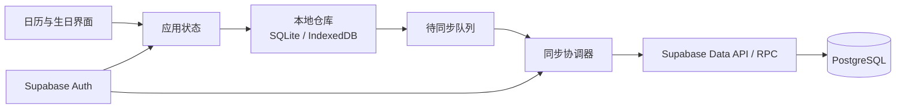

# 岁岁日历 · 账号登录技术方案

版本：V0.5｜日期：2026-10-10｜状态：账号头像客户端、私有 Storage 迁移与注销清理已实现；远端头像迁移和真机验收待执行

依据：[账号登录产品设计](account-login-product-design.md)与[现有移动端技术方案](technical-design.md)。本方案增加邮箱密码认证、云端存储和跨设备同步，同时保留当前手机 SQLite、电脑 IndexedDB 与离线使用能力。

## 1. 技术决策与范围

账号与云端采用 **Supabase Auth + PostgreSQL**，客户端继续使用 **Expo + React Native + TypeScript**。手机端以 SQLite 保存本地生日和时光记，电脑浏览器继续使用 Dexie + IndexedDB；登录后两端通过同一套同步协议访问 Supabase。

核心原则：

- 页面始终读取本地仓库，网络延迟或中断不能阻塞日历和生日管理。
- 每次本地修改先持久保存，再进入待同步队列；云端成功后更新同步状态。
- Supabase 负责身份认证和远端数据隔离，单独的同步模块负责离线队列、合并、重试和冲突处理。
- 未登录数据与各账号缓存按数据范围隔离，不能因登录、退出或切换账号混在一起。
- 每个异步本地操作在开始时固定账号范围；账号切换后，旧同步结果和旧错误不得落入新账号状态。
- 当前同步生日和时光记，不上传节日、节气、月历计算结果或应用临时状态。
- 账号头像使用独立的本地媒体与 Storage 同步通道，不写入事项 SQLite、IndexedDB、`sync_outbox` 或生日 RPC；头像失败不改变事项同步状态。



## 2. 技术栈

| 部分           | 选择                           | 职责                                         |
| -------------- | ------------------------------ | -------------------------------------------- |
| 认证           | Supabase Auth                  | 邮箱注册、验证、密码登录、会话刷新和密码重置 |
| 云端数据       | Supabase PostgreSQL            | 保存按用户隔离的生日、删除标记和同步版本     |
| 客户端 SDK     | `@supabase/supabase-js`        | 认证、数据请求与服务端函数调用               |
| 手机会话存储   | `expo-secure-store`            | 保存刷新令牌等认证会话；不保存用户密码       |
| 邮箱回调       | Expo Router + `expo-linking`   | 接收验证邮箱和重置密码的深链接               |
| 手机本地数据   | 现有 `expo-sqlite`             | 离线生日、账号数据范围、待同步操作和冲突记录 |
| 电脑本地数据   | 现有 Dexie + IndexedDB         | 提供与手机相同的本地优先行为                 |
| 服务端受控操作 | Supabase Edge Functions        | 注销账号等不能把高权限密钥放入客户端的操作   |
| 头像选择与处理 | Expo ImagePicker / Manipulator | 系统相册选择、1:1 裁剪、512 像素 JPEG 重编码 |
| 头像云端       | Supabase Storage 私有 bucket   | 当前用户固定路径的认证下载、覆盖和删除       |

原生端会话使用 SecureStore 适配器，并处理会话内容过大时的分段保存与完整删除；分片数量设有上限，损坏或篡改的元数据不会触发无界读写。浏览器端使用独立的 Web 会话适配器。Expo 的 SecureStore 用于本机机密键值，不能作为生日数据或云端数据的唯一来源。

参考官方文档：[Supabase Expo React Native](https://supabase.com/docs/guides/getting-started/quickstarts/expo-react-native)、[密码认证](https://supabase.com/docs/guides/auth/passwords)、[RLS](https://supabase.com/docs/guides/database/postgres/row-level-security)、[Edge Functions](https://supabase.com/docs/guides/functions)、[Expo SDK 57 SecureStore](https://docs.expo.dev/versions/v57.0.0/sdk/securestore/)和[Expo SDK 57 Linking](https://docs.expo.dev/versions/v57.0.0/sdk/linking/)。

## 3. 模块边界

在现有适度拆分的结构上增加认证与同步职责，不让页面直接调用 Supabase：

```text
mobile/src/
  auth/
    client.ts                 # Supabase 客户端和环境配置
    auth.ts                   # 认证接口、输入校验和错误翻译
    session-storage.ts        # 原生 SecureStore 实现
    session-storage.web.ts    # Web 实现
  sync/
    model.ts                  # 本地仓库与远端网关的同步边界
    coordinator.ts            # 队列上传、完整拉取和冲突协调
    remote.ts                 # 云端生日与受控 RPC 适配器
  avatar/
    model.ts                  # 头像元数据与本地/远端接口边界
    processor.ts              # 系统相册选择、裁剪、重编码和哈希
    private-store*.ts         # 原生私有文件 / Web Cache Storage
    metadata*.ts              # 仅保存当前账号的头像引用与同步状态
    remote.ts                 # 私有 Storage 认证网关
  data/
    repository*.ts            # 现有本地仓库，增加数据范围与同步事务
  state/
    AuthProvider.tsx          # 会话、邮箱和认证动作
    SyncProvider.tsx          # 数据范围、同步时机、首次导入和退出保护
    AppProvider.tsx           # 生日状态，本地写入后调度同步

supabase/
  migrations/                # 云端表、约束、函数和 RLS 策略
  functions/delete-account/  # 注销账号
mobile/tests/
  *.integration.ts           # 本地迁移、同步协议与服务端安全结构检查
```

认证模块只处理“用户是谁和会话是否有效”；同步模块只处理“哪些事项需要上传、下载或解决冲突”；生日、时光记和农历计算模块继续保持纯业务逻辑，不依赖账号或网络。

头像由 `AvatarProvider` 放在认证与事项同步之间。会话变化时先清空内存中的旧头像，再读取新账号独立元数据；旧账号异步结果通过账号范围和代次检查丢弃。原生头像存于应用私有 document 子目录，Web 存于 Cache Storage；元数据只含 `ownerKey`、私有文件引用、SHA-256、远端路径、更新时间与 `pending-upload` / `pending-delete` / `synced` 状态，不含图片二进制或 Base64。

图片只从系统相册选择。原生端先使用系统方形裁剪，客户端再按中心方形裁剪、缩放到 512×512 并重新编码为压缩质量 0.82 的 JPEG。新文件不会复制 EXIF 或位置字段。替换采用“先持久化新文件和元数据，再清理旧文件”；删除采用本机立即回退和可重试云端删除标记。

## 4. 数据模型

### 云端事项

云端沿用 `birthdays` 表名以兼容已有数据，每行保存一条生日或时光记，并增加同步字段：

| 字段                                   | 说明                                                                     |
| -------------------------------------- | ------------------------------------------------------------------------ |
| `id`                                   | 客户端生成的 UUID，跨设备保持不变                                        |
| `user_id`                              | Supabase Auth 用户 ID，外键删除采用级联规则，所有访问均按此隔离          |
| `item_type`、`name`、农历与阳历字段    | 区分生日和时光记；服务端重复执行日期、类型与非空约束                     |
| `birth_year`                           | 生日可选出生年份，允许空值或 1901—2100；时光记必须为空                   |
| `start_date` / `note` / `display_mode` | 时光记的开始日期、备注和展示方式；展示方式只允许 `days` 或 `anniversary` |
| `version`                              | 服务端递增的记录版本，用于并发修改检查                                   |
| `created_at` / `updated_at`            | 由服务端生成的 UTC 时间，不信任设备时钟决定先后                          |
| `deleted_at`                           | 软删除时间；保留删除记录，避免离线旧设备把事项重新上传                   |

`id` 与 `user_id` 组成唯一归属关系，`user_id` 建索引。删除标记在账号存续期间保留；用户注销时随账号数据一起清除。

云端另设同步操作记录，以 `user_id + operation_id` 唯一标识一次客户端提交。相同操作因超时重试时返回原结果，不能重复创建或重复递增版本。

### 本地数据

本地数据库升级时增加：

- `ownerKey`：区分未登录数据与不同账号缓存。
- `remoteVersion`：记录上次确认的云端版本。
- `sync_outbox`：保存操作 ID、生日 ID、操作类型、基础版本和必要载荷。
- `sync_conflicts`：在自动合并不安全时同时保留本机与云端版本。

现有未登录生日和时光记先归入本机访客范围。数据库迁移失败必须完整回滚，不得清空已有事项。

## 5. 认证与会话流程

### 注册和邮箱验证

客户端调用 Supabase Auth 注册邮箱与密码。开启邮箱确认后，未验证账号不启动云同步；验证邮件分别配置 Web 回调地址和现有应用 scheme 对应的 `suisui://auth/callback`。原生回调必须使用 development build 或正式安装包验收，不能依赖 Expo Go 的临时地址。

正式发布前接入自定义 SMTP、发件域名和中文邮件模板。Supabase 默认邮件服务只用于开发验证，不作为生产发信方案。

### 登录与保持会话

- 使用 `signInWithPassword` 登录，认证成功后恢复对应账号的本地范围并启动同步。
- Supabase 客户端开启会话持久化与自动刷新；应用进入前台时恢复刷新，进入后台时停止不必要的刷新。
- 邮箱链接只接受应用配置的精确回调目标和 PKCE `code`；不接受外部来源、相似路径或 URL 中的明文访问令牌。密码重置链接额外携带恢复标记，会话自动刷新不能提前退出设置新密码状态。
- 手机会话写入 SecureStore，退出登录和注销成功后显式删除；用户密码不进入 SQLite、IndexedDB、日志或错误上报。
- Web 端持久会话需限制第三方脚本并配置内容安全策略；公开部署时再按实际托管方式复核浏览器会话方案。

### 找回密码

调用 `resetPasswordForEmail` 发送重置邮件，统一显示“如果邮箱已注册，将收到邮件”，避免暴露账号是否存在。回调进入公开的更新密码页面，确认有效恢复会话后允许设置新密码。

### 退出与注销

退出前检查待同步队列：优先完成同步；失败时由用户选择留在当前账号重试或明确放弃未同步修改。退出成功后清除当前账号本地缓存和认证会话，再进入空的访客范围。

注销账号通过带当前用户 JWT 的 Edge Function 执行。函数验证调用者身份，删除用户数据并在服务端调用 Auth 管理接口；`service_role` 或其他高权限密钥只存在服务端。客户端收到成功结果后清除会话与本地账号范围。

## 6. 同步协议

### 写入路径

1. 用户新增、编辑或删除生日。
2. 本地仓库在同一事务内写入生日与 `sync_outbox`，界面立即展示结果。
3. 同步协调器按创建顺序提交操作，携带唯一 `operation_id` 和 `baseVersion`。
4. 服务端检查用户归属、数据约束与记录版本；成功后递增版本并返回服务端记录。
5. 客户端在本地事务内应用返回结果并移除已确认的队列项。

上传失败不回滚用户已经保存的本地修改。认证失效时暂停队列并要求重新登录；临时网络或服务错误采用有限退避重试，保留手动重试入口。

### 拉取与刷新

生日数量较少，第一阶段每次同步直接拉取该用户的完整云端生日集合及删除标记，降低增量游标遗漏的风险。拉取结果在本地事务内按 ID 和版本合并。

同步触发时机包括：登录成功、应用启动并恢复会话、回到前台、网络恢复、本地生日改动完成后，以及用户点击失败提示重试。应用前台可低频检查远端变化；第一阶段不依赖 Realtime 保证正确性，避免断线漏事件后本地状态长期错误。同步网关在读写前核对当前会话用户，并显式按 `user_id` 查询；账号切换时旧任务停止落库，新账号任务独立排队执行。新版客户端读写前会显式查询 `birth_year` 能力；迁移未部署时同步明确失败，不把忽略新字段的旧 RPC 结果误报为成功。

### 首次登录与重复数据

- 当前设备只有访客数据时，用户确认后将其作为一批待同步操作导入账号。
- 本机与云端相同 ID 且版本连续的记录自动合并。
- 内容完全相同但 ID 不同时自动跳过；其他 ID 不同的记录都保留，避免误把同名亲友当作一人。
- 云端确认成功前保留原访客数据；任何一步失败都可以重试，不能出现“本地已清除但云端未保存”。

### 并发冲突

服务端只在 `baseVersion` 等于当前版本时接受修改。同一生日被两台设备先后编辑时，后提交设备收到冲突结果；客户端保留本机版本和云端版本，让用户选择使用哪一个。删除与编辑冲突同样需要确认，不用设备时间直接覆盖。

## 7. 云端安全与环境

- `birthdays` 开启 Row Level Security，查询要求已认证且 `auth.uid() = user_id`。客户端角色只保留本账号数据的 `SELECT` 权限，写入必须经过带版本检查和幂等操作号的 `apply_birthday_mutation` RPC，不能绕过同步协议直接增删改表。
- `sync_operations` 不向客户端角色开放表权限；RPC 执行权限只授予 `authenticated`，并在安全定义函数内部再次要求 `auth.uid()`。
- 客户端只包含项目 URL 与 publishable key。数据库密码、SMTP 密码、`service_role` 和 Edge Function 密钥不得进入 `EXPO_PUBLIC_*`、安装包或仓库。
- 云端继续设置与本地一致的姓名、日期、双生日和出生年份约束，不能只依赖客户端校验。
- `account-avatars` bucket 必须保持 `public = false`，大小上限 1 MiB、MIME 仅允许 `image/jpeg`。Storage RLS 对查询、插入、更新和删除都要求对象名严格等于 `<auth.uid()>/avatar.jpg`；客户端不生成公开 URL或长期签名 URL，只使用当前认证会话下载。
- 所有网络请求使用 HTTPS；日志不记录密码、完整令牌或重置链接。
- 开发、测试和生产使用独立 Supabase 环境、回调白名单与密钥；数据库变更通过仓库中的迁移文件执行。
- 正式发布前在目标手机和实际网络中验证 Supabase 与邮件服务的可达性、延迟和失败提示；若托管可用性不满足要求，通过认证和远端仓库接口替换服务端，不改动农历与页面核心逻辑。

## 8. 测试与验收

| 层次              | 覆盖重点                                                                                                                   |
| ----------------- | -------------------------------------------------------------------------------------------------------------------------- |
| 认证单元测试      | 注册、验证状态、登录、会话恢复、刷新、找回密码、退出和错误映射                                                             |
| 本地迁移测试      | 现有 v2 生日进入访客范围、账号隔离、迁移失败回滚和高版本保护                                                               |
| 同步单元测试      | 离线写入、顺序重试、重复提交幂等、完整拉取、软删除、首次导入和冲突保留                                                     |
| Supabase 集成测试 | 数据约束、版本检查、操作幂等，以及两个测试用户之间的 RLS 隔离                                                              |
| 组件测试          | 登录注册表单、密码显示、同步状态、疑似重复处理、冲突处理和未同步退出提示                                                   |
| Web 与真机验收    | 邮箱深链接、杀进程后恢复、断网编辑、联网同步、手机与电脑互改、退出清理和注销                                               |
| 安全检查          | 客户端包无高权限密钥、日志无令牌、伪造回调与明文令牌被拒、跨用户及账号切换竞态失败、客户端直写表失败、注销函数拒绝无效会话 |

测试账号和测试数据只能用于开发或测试环境。Supabase 本地环境可覆盖迁移、约束和 RLS；真实邮件、深链接、会话持久化和目标网络仍需在测试项目及真实设备上验证。

## 9. 实施顺序

1. **已完成：认证客户端。** 会话适配器、注册登录、邮箱验证、密码重置和回调路由已接入。
2. **已完成：本地仓库升级。** SQLite 与 IndexedDB 已增加数据范围、待同步队列和冲突存储，旧数据无损进入访客范围。
3. **已完成：同步与账号管理。** 已实现本地优先写入、幂等上传协议、完整拉取、软删除、退避重试、首次合并、冲突处理、退出保护和注销 Edge Function。
4. **已完成基础联调：云端与 Android。** Supabase 账号登录、基础同步和 Android 安装运行已验证，安全加固迁移已部署并复核权限。
5. **已完成：出生年份开发项目迁移。** `202609220001_birthday_birth_year.sql` 已部署到“岁岁日历-dev”；线上复核确认旧记录字段为空、数量不变，出生年份约束、RLS、只读表权限与受控 RPC 均保持有效，现有真实账号同步不再报告能力缺失并显示本机与云端一致。
6. **待继续：跨端安全验收。** 使用两个测试账号验证非空出生年份写入与跨端保留、跨用户 RLS、密码重置、账号快速切换与断网恢复；iOS 按现有构建条件单独验收。
7. **已实现、待部署：账号头像。** 客户端选择、方形处理、私有缓存、离线待同步、删除和账号隔离已完成；需向目标 Supabase 应用 `202610090001_account_avatars.sql` 并重新部署 `delete-account`，再执行 Android 相册裁剪、应用重启、A/B 账号和第二设备恢复验收。

这一阶段不改变农历换算、节日、提醒和月历规则。账号与同步稳定后，再安排系统通知、备份导出和 Windows 独立安装包。
